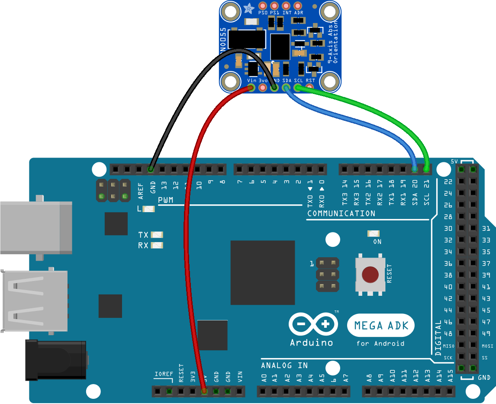

# IMU Reading and Reporting
The `.ino` file in this directory contains simple code for an Arduino to read data from an IMU connected to it by I^2^C and report that data via serial out. Though not really necessary for the low complexity of the tasks involved, I used FreeRTOS to manage the read and reporting steps as a learning exercise.

## Setup
As noted in the primary README, you will need a BNO055 IMU connected to an Arduino via I^2^C, as in the diagram below. *Note: an Arduino MEGA was used for this project; if building with another board such as the UNO, different pins may be needed for the I^2^C wiring.*

Pull down `imu_i2c_rtos.ino` on the machine you'll use to load the code onto your Arduino. If you're not using a MEGA, adjust line 25 (`Adafruit_BNO055 currentIMU = Adafruit_BNO055(55, 0x28, &Wire);`) as needed to point to the correct pin for your I^2^C wiring. You will also need to import the following libraries:
- `Adafruit_Sensor`
- `Adafruit_BNO055`
- `Arduino_FreeRTOS`

Compile and upload to your board. Assuming you're connected via the USB serial connection, you should be able to open up a serial monitor and see the roll, pitch, and yaw data printed out and updating as you tilt the IMU.